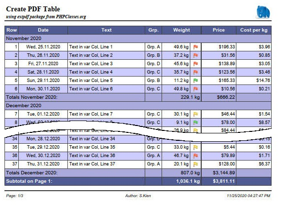

# Schritt- für Schritt Beschreibung des extpdf - Beispiels
In diesem Tutorial wird der Beispielcode zum Paket ***extpdf*** detailiert erläutert. 
Das Beispiel generiert den Bericht
  

auf Basis folgender Zeilendaten
```php	
	$row = array(
		'text' => <string>,
		'weight' => <float>,
		'date' => <float>,
		'price' => <float>,
		'grp_id' => <int>
	);
```

der Code ist in den Queldateien **`XFPDFExample.php`** und **`XFPDFExample.class.php`** zu finden.

Um das Paket verwenden zu können, ist es zunächst erforderlich, eine eigene Klasse zu erstellen, 
die die Klasse XPDF erweitert. In dieser Klasse wird alles definiert, um das Aussehen des Berichts
festzulegen:
- Setzen eines Logos für die Kopfzeile
- Fusszeile
- Schriftarten und Farben
- auszugebenden Tabellenspalten
	- Überschrift
	- Inhalt
	- Breite
	- Ausrichtung
	- Format
- Erzeugen von Summen- und Übertragszeilen
- Gruppierung von Zeilen

Über diese Klasse wird dann der Bericht erstellt, indem die vorhandenen Daten übergeben werden.

## Übersicht
1. Implementieren der Beispielklasse zur Definition des Berichts
	1. Schriftarten/Farben, Logo und Fusszeile
		1. Schriftarten und Farben
		2. Logo
		3. Fusszeile
	2. Spaltendefinition Beispieltabelle
		1. und hier der Code dazu
		2. die einzelnen Codezeilen genauer erläutert
		3. Generieren der Zelleninhalte die nicht direkt in den Zeilendaten enthalten sind
	3. Gruppieren von Zeilen mit Gruppenheader und Gruppensumme
		1. Starten der Gruppierung und Ausgabe der Zwischensumme
		2. Ausgabe der letzten Zwischensumme am Ende der Tabelle
	4. Zwischenüberschriften, Manipulation der Zeilendaten vor der Ausgabe
2. Verwenden der Beispielklasse
	1. Start der Tabelle
	2. Übergabe der Daten
	3. Beenden der Tabelle


## Implementieren der Beispielklasse zur Definition des Berichts
Im Beispiel wird die Klasse `ExampleXPDF` in der Datei `XFPDFExample.class.php` implementiert. 
Um eine Erweiterung der `XPDF` Klasse zu erzeugen, muss diese per `use` Statement bekannt
gemacht werden.
```php	
use SKien\XFPDF\XPDF;
```
Die Gestaltung des Berichts nehmen wir im Konstruktor der Klasse vor. Zunächst muss der 
Konstruktor der Elternklasse zur Initialisierung aufgerufen werden.
```php	
	public function __construct(string $orientation='P') 
	{
		parent::__construct($orientation);
		...
```

### Schriftarten/Farben, Logo und Fusszeile
```php	
	// ...
	$this->InitGrid('xfpdf-sample.json');
        
	// define page header and -footer
	$this->SetLogo('images/elephpant.png');
	$this->SetLogoHeight(9.0);
	$this->AddPageFooter("Seite: {PN}/{NP}\tAutor: S.Kien\t{D} {T}");
```

#### Schriftarten und Farben
Die Schriftarten und Farben können durch die unterschiedlichen Methoden `XPDF::SetXXXFont()`
und `XPDF::SetXXXColors()` gesetzt werden.

Es geht jedoch schneller und einfacher, wenn alle Einstellungen in einer JSON-Datei vorgenommen werden.
(diese kann zudem mehrfach für einheitliche Berichte verwendet werden).
Diese Datei kann an die `XPDF::InitGrid()` Methode übergeben werden.
```php	
	$this->InitGrid('xfpdf-sample.json');
```
Die Struktur dieser JSON-Datei ist selbsterklärend und kann der hier verwendeten Beispieldatei entnommen werden.

#### Logo
```php	
	$this->SetLogo('images/elephpant.png');
	$this->SetLogoHeight(9.0);
```
Das Logo wird in der Kopfzeile rechtsbündig ausgegeben. Standarmäßig wird das Logo auf eine Höhe
von 8mm skaliert. Im Beispiel wählen wir eine Höhe von 9mm.

#### Fusszeile
```php	
	$this->AddPageFooter("Page: {PN}/{NP}\tAuthor: S.Kien\t{D}");
```
In der Fusszeile wird standardmäßig links die Seite und Gesamtseitenzahl und rechts Datum und 
Uhrzeit des Ausdrucks ausgegeben.  
Im Beispiel wird diese Einstellung neu gesetzt. Die Seitenangabe wird um das Prefix *'Page: '* 
ergänzt, zentriert wird ein Autor angegeben und rechtsbündig das Datum ohne Uhrzeit ausgegeben. 
Datum und Uhrzeit werden in der Fusszeile entsprechend den `localeconv()` Einstellungen 
formatiert.
> Die Gebietsschemaeinstellungen können mit der Methode `XPDF::SetLocale()` gegenüber 
dem Systemstandard geändert werden.

### Spaltendefinition der Beispieltabelle
#### Spaltenbeschreibung
Die Tabelle im Beispiel enthält 8 Spalten:
1. Eine reine Nummerierungsspalte
	- Überschrift "Row"
	- Breite 10mm
	- rechtsbündig
	- automatische Nummerierung
	- Bei Summenzeilen soll ab dieser Spalte der jeweilige Text ausgegeben werden

2. Eine Datumsspalte
	- Überschrift "Date"
	- Breite 35mm
	- zentriert
	- der Inhalt ist direkt in den Zeilendaten enthalten 
	- Formatierung "Sat, 03.12.2020"

3. Eine 'normale' Textspalte
	- Überschrift "Text"
	- dyn. Breite -> die Spalte wird so breit, dass die Tabelle die komplette Seitenbreite ausfüllt
	- linksbündig
	- der Inhalt ist direkt in den Zeilendaten enthalten 
	
4. Eine Spalte mit dynamischem Inhalt
	- Überschrift "Grp."
	- Breite 12mm
	- zentriert
	- der Inhalt muß aus den Zeilendaten generiert werden

5. Eine Spalte mit nummerischem Inhalt
	- Überschrift "Weight"
	- Breite 20mm
	- rechtsbündig
	- der Inhalt ist direkt in den Zeilendaten enthalten 
	- Formatierung mit 1 Nachkommastelle und dem Zusatz "kg"
	- für die Spalte soll eine Summe berechnet werden
	
6. Eine Symbol-Spalte
	- Keine Überschrift (Spaltenheader wird mit der vorherigen Spalte verbunden)
	- Breite 8mm
	- das anzuzeigende Symbol ist abhängig vom Wert der Spalte *'weight'*
	
7. Eine Währungsspalte
	- Überschrift "Price"
	- Breite 25mm
	- rechtsbündig
	- der Inhalt ist direkt in den Zeilendaten enthalten 
	- Formatierung mit Währungssymbol
	- für die Spalte soll eine Summe berechnet werden

8. Eine Berechnungsspalte
	- Überschrift "Cost per Kg"
	- Breite 25mm
	- rechtsbündig
	- der Inhalt wird aus den Zeilendaten berechnet 
	- Formatierung als Währung mit Währungssymbol

#### und hier der Code dazu

```php	
    $this->AddCol('Row', 10, 'R', XPDF::COL_ROW_NR, XPDF::FLAG_TOTALS_TEXT);
	$this->AddCol('Date', 35, 'C', 'date', XPDF::FLAG_DATE);
	$this->AddCol('Text', -1, 'L', 'text');
	$this->AddCol('Grp.', 12, 'C', self::MY_GRP_COL);
	$this->AddCol('Weight', 20, 'R', 'weight', XPDF::FLAG_TOTALS_CALC | XPDF::FLAG_NUMBER);
	$iImgCol = $this->AddCol(-1,     8, 'C', self::MY_IMAGE_COL,   XPDF::FLAG_IMAGE | XPDF::FLAG_TOTALS_EMPTY);
	$this->AddCol('Price', 25, 'R', 'price', XPDF::FLAG_TOTALS_CALC | XPDF::FLAG_CUR_SYMBOL);
	$this->AddCol('Cost per Kg', 25, 'R', self::MY_CALC_COL, XPDF::FLAG_TOTALS_EMPTY);
        
	// enable the totals/pagetotals and carry-over functionality
	$this->EnableTotals(XPDF::TOTALS | XPDF::PAGE_TOTALS | XPDF::CARRY_OVER);
	$this->SetTotalsText(
		"My Totals over all:",
		"Subtotal on Page {PN}:",
		"Carry over from Page {PN-1}:");
	
	// set date and number formating.
	$this->SetDateFormat('%a, %d.%m.%Y');
	$this->SetNumberFormat(1, '', ' kg');
	
	// and set meassuring for the image col
	$this->SetColImageInfo($iImgCol, 1.5, 2.5, 3 );
```

#### die einzelnen Codezeilen genauer erläutert

##### Spalte 1
```php	
    $this->AddCol('Row', 10, 'R', XPDF::COL_ROW_NR, XPDF::FLAG_TOTALS_TEXT);
```
- 	Die Spalten-ID `XPDF::COL_ROW_NR` definiert den Inhalt der Spalte als automatische Zeilennummer.
-	`XPDF::FLAG_TOTALS_TEXT` legt die Ausgabe des Textes bei Summenzeilen in dieser Spalte fest.
	Alle weiteren Spalten werden bis zur nächsten Summenspalte mit dieser Spalte verbunden.

##### Spalte 2
```php	
	AddCol('Date', 30, 'C', 'date', XPDF::FLAG_DATE);
```
-	Der Inhalt des Element *'date'* der Zeilendaten wird als Datumswert interpretiert.
	Akzeptiert werden: 
	- ein ***DateTime***-Object
	- ein ***int*** als UNIX-Timestamp
	- ein ***string*** wird versucht, mit `strtotime()` zu parsen
-	Mit `XPDF::FLAG_DATE` wird die Spalte entsprechend `SetDateFormat()` formatiert.

##### Spalte 3
```php	
	AddCol('Text', -1, 'L', 'text');
```
-	Der Inhalt des Element *'text'* der Zeilendaten wird ausgegeben
-	Mit einer Breite von -1 wird die Spalte als dynamische Spalte definiert. Damit erhält die
	Spalte den restlichen verfügbaren Platz, damit die Tabelle die Seitenbreite komplett ausfüllt

##### Spalte 4
```php	
	AddCol('Grp.', 12, 'C', self::MY_GRP_COL);
```
-	Mit der selbst definierten eindeutigen Spalten-ID `self::MY_GRP_COL` wird erreicht, dass die 
	Methode `Col()` aufgerufen wird, in der der gewünschte Inhalt der Zelle mit Hilfe der Zeilendaten 
	generiert werden kann.
	`Col()` muss in der abgeleiteten Klasse überladen werden.

##### Spalte 5
```php	
	AddCol('Weight', 20, 'R', 'weight', XPDF::FLAG_TOTALS_CALC | XPDF::FLAG_NUMBER);
```
-	Der Inhalt des Element *'weight'* der Zeilendaten wird als Numerischer Wert interpretiert.
-	`XPDF::FLAG_TOTALS_CALC` gibt an, dass für diese Spalte eine Summe berechnet wird.
-	Mit `XPDF::FLAG_NUMBER` wird die Spalte entsprechend `SetNumberFormat()` formatiert.
	
##### Spalte 6
```php	
	$iImgCol = $this->AddCol(-1,     8, 'C', self::MY_IMAGE_COL,   XPDF::FLAG_IMAGE | XPDF::FLAG_TOTALS_EMPTY);
```
-	Ein Wert von -1 als Spaltenüberschrift gibt an, das der Spaltenheader mit dem Header der vorherigen Spalte verbunden wird.
-	Mit der definierten Spalten-ID `self::MY_IMAGE_COL` wird die Methode `Col()` aufgerufen, in der die 
	anzuzeigende Grafik abhängig von Wert der Spalte "Weight" gesetzt wird.
-	Damit in einer Summenzeile in dieser Spalte eine entsprechende Leerzelle ausgegeben wird, muss 
	nach der vorherigen Summenspalte `XPDF::FLAG_TOTALS_EMPTY` gesetzt werden.
	Alle weiteren Spalten werden bis zur nächsten Summenspalte oder bis zur letzten Spalte mit 
	dieser verbunden.
-	Der Spaltenindex wird in `$iImgCol` gespeichert, um nachfolgend die `SetColImageInfo()` setzen zu können
	
##### Spalte 7
```php	
	AddCol('Price', 25, 'R', 'price', XPDF::FLAG_TOTALS_CALC | XPDF::FLAG_CUR_SYMBOL);
```
-	Der Inhalt des Element *'price'* der Zeilendaten wird als Numerischer Wert interpretiert.
-	`XPDF::FLAG_TOTALS_CALC` gibt an, dass für diese Spalte eine Summe berechnet wird
-	Mit `XPDF::FLAG_CUR_SYMBOL` wird die Spalte entsprechend `SetCurrencyFormat()` formatiert

##### Spalte 8
```php	
	AddCol('Cost per Kg', 25, 'C', self::MY_CALC_COL, XPDF::FLAG_TOTALS_EMPTY);
```
-	Um einen Wert aus den Zeilendaten zu berechnen, erhält die Spalte ebenfalls eine Spalten-ID
	(`self::MY_CALC_COL`), wodurch auch hier die Methode `Col()` aufgerufen wird, in der der 
	gewünschte Inhalt berechnet und formatiert wird.
-	`XPDF::FLAG_TOTALS_EMPTY` wird entsprechend Spalte 5 für eine korrekt Ausgabe der
	Summenzeilen benötigt.

##### Die Ausgabe von Summenzeilen aktivieren.
```php	
	$this->EnableTotals(XPDF::TOTALS | XPDF::PAGE_TOTALS | XPDF::CARRY_OVER);
```
- `XPDF::TOTALS`: Gesamtsumme am Ende des Dokumentes.
- `XPDF::PAGE_TOTALS`: Zwischenumme bei jedem Seitenwechsel.
- `XPDF::CARRY_OVER`: Übertrag am Seitenanfang ab der 2'ten Seite.

##### Setzen der Texte für die verschiedenen Summenzeilen.
```php	
	$this->SetTotalsText(
		"My Totals over all:",
		"Subtotal on Page {PN}:",
		"Carry over from Page {PN-1}:");
```
Der Text wird in der ersten Spalte, in der das Flag `XPDF::FLAG_TOTALS_TEXT` gesetzt ist (Spalte 1), ausgegeben.  
Die Texte können die Platzhalter *'{PN}'* für die aktuelle Seite und *'{PN-1}'* für die vorherige Seite enthalten.

##### Setzen des Ausgabeformats für alle Date-Spalten.
```php	
	$this->SetDateFormat('%a, %d.%m.%Y');
```
Der Formatstring muss den Richtlinien der PHP-Funktion 'strftime()' entsprechen.  
Siehe https://www.php.net/manual/en/function.strftime.php

##### Setzen des Ausgabeformats für alle Numeric-Spalten
```php	
	$this->SetNumberFormat(1, '', ' kg');
```
- Eine Nachkommastelle.
- Kein Präfix.
- Erweiterung *' kg'*.

Dezimal- und Tausendertrennzeichen werden aus den `localeconv()` Einstellungen ausgelesen.  
> Die Gebietsschemaeinstellungen können mit der Methode `XPDF::SetLocale()` gegenüber 
dem Systemstandard geändert werden.

##### Setzen von Größe und Position der Grafik in der Symbolspalte
```php	
	$this->SetColImageInfo($iImgCol, 1.5, 2.5, 3 );
```
- der Spaltenindex der beim Erzeugen der Spalte gespeichert wurde.
- 1.5mm Abstand vom oberen Zeilenrand.
- 2.5mm Abstand vom linken Zellenrand.
- Höhe 3mm.
- Ohne Breitenangabe bleibt das Seitenverhältniss der Orginalgrafik erhalten.

#### Generieren der Zelleninhalte die nicht direkt in den Zeilendaten enthalten sind
Wenn der anzuzeigende Inhalt einer Zelle nicht direkt in den Zeilendaten vorhanden ist,
kann für diese Spalte anstelle des Datenfeldes eine eindeutige ID gesetzt werden. In der 
zu überladenden Methode `ExampleXPDF::Col()` kann dann der auszugebende Text gesetzt werden.
Dies ist z.B. der Fall, wenn
- die Daten einen numerischen Code enthalten, dem ein Text zugeordnet werden muss
- ein Berechnungsergebniss aus mehreren Werten ausgegeben werden soll
- eine spezielle Formatierung gewünscht ist
- der anzuzeigende Wert abhängig von weiteren externen Faktoren ist.

Im Beispiel werden die Spalten 4,5 und 8 intern generiert.
```php	
	/** const for own column ID's */
	const MY_GRP_COL = 1;
	const MY_IMAGE_COL = 2;
	const MY_CALC_COL = 3;
```
Für diese Spalten werden eindeutige ID's definiert, die beim erstellen der Spalte mmit
`AddCol()` angegeben werden.

In der `ExampleXPDF::Col()` Methode erfolgt dann die Bearbeitung:
```php	
	protected function Col(int $iCol, array $row, bool &$bFill) : string 
	{
		$strCol = '';
		switch ($iCol) {
			case self::MY_GRP_COL:
				$aValues = array( '', 'Grp. A', 'Grp. B', 'Grp. C', 'Grp. D');
				if ($row['grp_id'] < 0 && $row['grp_id'] <= 4) {
					$strCol = $aValues[$row['grp_id']];
				}
				break;
			case self::MY_IMAGE_COL:
				$strCol = 'images/';
				$fltWeight = floatval($row['weight']);
				if ($fltWeight > 35.0) {
					// ... to heavy
					$strCol .= 'red.png';
				} else if ($fltWeight > 20.0) {
					// ... just in the limit
					$strCol .= 'yellow.png';
				} else {
					$strCol .= 'green.png';
				}
				break;
			case self::MY_CALC_COL:
				$fltPricePerKg = 0.0;
				if (floatval($row['weight']) != 0) {
					$fltPricePerKg = floatval($row['price']) / floatval($row['weight']);;
				}
				$strCol = $this->_FormatCurrency($fltPricePerKg, true);
				break;
			default:
				// very important to call parent class !!
				$strCol = parent::Col($iCol, $row, $bFill);
				break;
		}
		return $strCol;
	}
```
1. `self::MY_GRP_COL`  
Hier wird anstelle des numerischen Datenwertes das entsprechende Textkürzel zugeordnet.

2. `self::MY_IMAGE_COL`  
Abhängig vom Datenfeld *'weight'* wird ein entsprechendes Image gesetzt.

3. `self::MY_CALC_COL`  
Der Wert wird aus den Zeilendaten berechnet und als Währungsfeld formatiert.

4. `default`  
Im `default` Zweig muss unbedingt die Methode der Elternklasse ausferufen werden!

### Gruppieren von Zeilen mit Gruppenheader und Gruppensumme
Zur Veranschaulichung der Gruppierungsfunktion mit Zwischensummen wird im Beispiel
für jeden Monat der Datumsspalte eine Zwischenüberschrift und eine Zwischensumme
ausgegeben.  
Um auf einen Monatswechsel reagieren zu können, erhält die Klasse die Eigenschaft
`strMonth`, die zunächst mit einem Leerstring initialisiert wird.  
```php
	/** @var string remember month and year of the previous row */ 
	protected string $strMonth = '';
```
Zudem sind folgende Schritte erforderlich:
- Starten der Gruppierung und Ausgabe der Zwischensumme.
- Ausgabe der letzten Zwischensumme am Ende der Tabelle

#### Starten der Gruppierung und Ausgabe der Zwischensumme
Um festzustellen, ob bei der Ausgabe ein Monatswechsel stattfindet, wird die Methode
`XPDF:PreRow()` in der Beispielklasse überladen. Diese Methode wird immer VOR der Ausgabe 
eine neuen Zeile aufgerufen.
```php
	protected function PreRow(array &$row) : string
	{
		// for grouping
		$date = strtotime($row['date']);
		$strMonth = date('Y-m', $date);
		if ( $this->strMonth != $strMonth) {
			// first row we have no subtotals...
			if ($this->strMonth != '') {
				$this->EndGroup();
			}
			$this->StartGroup('Totals ' . strftime('%B %Y', $date) . ':', strftime('%B %Y', $date));
			$this->strMonth = $strMonth;
		}
		...
	}
```
Indem der Monat des Datumsfeldes der Zeilendaten (`$row['date']`) mit dem bisherigen Monat 
verglichen wird, kann festgestellt werden, ob ein Monatswechsel vorliegt.  
Falls der bisherge Monat kein Leerstring war (was nur beim ersten Aufruf der Methode
der Fall ist...), wird mit `XPDF::EndGroup()` die Zwischensumme für den bisherigen Monat
ausgegeben. Danach wird die Gruppierung mit `XPDF::StartGroup()` für den neuen Monat 
gestartet. Wird dieser Funktion der Parameter `strHeader` nicht übergeben, so wird
lediglich die interne Berechnung der Zwischensummen neu gestartet, aber keine Zwischenüberschrift 
ausgegeben.  
Zuletzt wird der neue Monat in die Eigenschaft `strMonth` übernommen.

#### Ausgabe der letzten Zwischensumme am Ende der Tabelle
Um für den letzten Monat die Teilsumme zu erhalten, muss diese NACH der letzten Datenzeile aber
VOR der Ausgabe der Gesamtsumme ausgegeben werden.  
Da dies verständlicherweise nicht in `XPDF:PreRow()` abgefangen werden kann, wird zu diesem Zweck 
die Methode `XPDF::EndGrid()` überladen, die grundsätzlich nach Übergabe aller Daten aufgerufen 
werden muss.
```php
	public function EndGrid() : void
	{
		// end last group for subtotals before we call the parent (!!! don't forget that!!)
		$this->EndGroup();
		parent::EndGrid();
	}
```
Hier wird lediglich ein letztes mal `XPDF::EndGroup()` aufgerufen, bevor die weiteren
Bearbeitung an die Elternklasse weitergegeben wird  
(**der Aufruf der Elternklasse darf in keinen Fall vergessen werden!**)

### Zwischenüberschriften, Manipulation der Zeilendaten vor der Ausgabe
Manchmal ist es erforderlich, die Daten für eine Ausgabezeile Aufgrund eines bestimmten
Kriteriums vor der Ausgabe zu verändern oder um zusätzlich Informationen zu ergänzen, und/oder
zur besseren Kennzeichnung eine Zwsichenüberschrift einzufügen.  
Auch für diese Aufgabe kann die Methode `XPDF:PreRow()` in der eigenen Klasse überladen
werden.  
```php
	protected function PreRow(array &$row) : string
	{
		...
		$strSubRow = '';
		if ($this->iRow == 47) {
			$strSubRow = '... next Row have been manipulated in ExampleXPDF::PreRow(array &$row)!';
			$row['text'] = 'manipulated Rowdata!';
		}
		if ($this->iRow == 56) {
			$row['text'] = 'manipulated Rowdata without Subrow!';
		}
		return $strSubRow;
	}
```
In der Beispielklasse wird einfach nur bei einer festen Zeilennummer (#47) ein Datenfeld verändert
und die Zeile durch eine entsprechende Zwischenüberschrift hervorgehoben.  
Bei einer Zweiten festen Zeile (#56) wird nur das Datenfeld verändert wobei die Zeile dann
ohne Zwischenüberschrift ausgegeben wird.  

## Verwenden der Beispielklasse
Der Bericht wird in der Datei `XFPDFExample.php` erstellt. Die erforderlichen Dateien des
Pakets werden per autoloader eingebunden, die Beispielklasse wird includiert.
```php	
require_once 'autoloader.php';
require_once 'XFPDFExample.class.php';
```

Als erstes wird eine Instanz der Beispielklasse erstellt und einige Inormationen und die 
Überschriften gesetzt.
$pdf = new ExampleXPDF();
```php	
$pdf = new ExampleXPDF();

// set some file information
$pdf->SetInfo('XFPDF', 'Example', 'PHP classes', 'Keyword1, Keyword2, ...');
$pdf->SetPageHeader( 'Create PDF Table', 'using extpdf package from PHPClasses.org');
```
Mit `SetInfo()` werden Datei-Informationen gesetzt, die im erzeugten Dokument unter den 
Dokumenteigensschaften angezeigt werden.
- *'XFPDF'*: Titel
- *'Example'*: Kurzbeschreibung
- *'PHP classes'*: Autor
- *'Keyword1, Keyword2, ...'*: Schlüsselwörter

`SetPageHeader()` setzt den Titel und optional eine Kurzbeschreibung:
- Titel linksbündig in der mmit XPDF::SetHeaderFont() festgelegten Schriftart
- die Kurzbeschreibung ebenfalls linksbündig in einer neuen Zeile in der Schriftart XPDF::SetSubjectFont()

Nachdem alle Dokumenteneinstellungen vorgenommen wurden, kann die Tabelle erzeugt werden:
```php	
$pdf->Prepare();

$date = time();
for ($iRow=1; $iRow <= 100; $iRow++) {
	$row = array(
		'text' => 'Text in var Col, Line ' . $iRow,
		'weight' => (rand(10, 500) / 10),
		'date' => date('Y-m-d', $date),
		'price' => (rand(10, 2000) / 9),
		'grp_id' => rand(1, 4)
	);
	$pdf->Row($row);
	$date += 24 * 60 * 60;
}
$pdf->EndGrid();

$pdf->CreatePDF('example');
```

### Start der Tabelle
```php	
$pdf->Prepare();
```
Mit diesem Aufruf wird die erzeugung der Tabelle gestarted.

### Übergabe der Daten
```php	
for ($iRow=1; $iRow <= 100; $iRow++) {
	$row = array(
		'text' => 'Text in var Col, Line ' . $iRow,
		'weight' => (rand(10, 500) / 10),
		'date' => date('Y-m-d', $date),
		'price' => (rand(10, 2000) / 9),
		'grp_id' => rand(1, 4)
	);
	$pdf->Row($row);
	$date += 24 * 60 * 60;
}
```
Der Einfachheit halber werden die Zeilendaten im Beispiel in einer for-Schleife 
mit Zufallswerten generiert und mit `$pdf->Row($row)` übergeben. In der Praxis 
werden die Daten aus einer Datenbankabfrage oder einer sonstigen Datenquelle
stammen.
Dies könnte dann wie folgt aussehen:
```php	
$db = new mysqli(...)
$dbres = $db->query('some SQL query');
while (($row = $dbres->fetch_array(MYSQLI_ASSOC) !== false) {
    $pdf->Row($row);
}
```

### Beenden der Tabelle
```php	
$pdf->EndGrid();
```
Zum Abschluss der Tabelle wird diese Funktion aufgerufen, die gegebenenfalls eineEndsumme 
generiert und die Tabelle abschliesst.

### Erzeugen der PDF-Datei
```php	
$pdf->CreatePDF('example');
```
Als letzter Schritt muss die Datei jetzt nur noch erzeugt werden.
