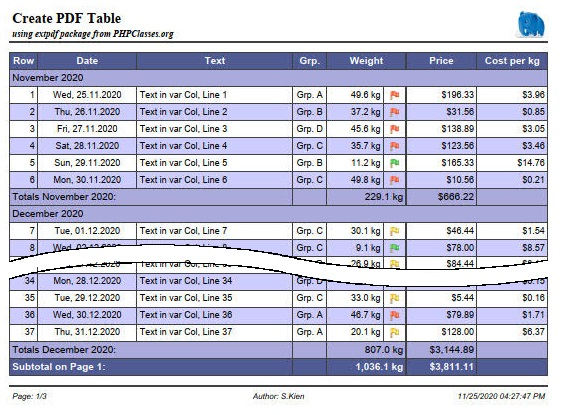

# Step-by-step description of the extpdf example
In this tutorial, the sample code for the **extpdf** package is explained in detail.  
The example generates the report  
  

based on the following data
```php	
	$row = array(
		'text' => <string>,
		'weight' => <float>,
		'date' => <float>,
		'price' => <float>,
		'grp_id' => <int>
	);
```

the code can be found in the source files **XFPDFExample.php** and **XFPDFExample.class.php**.

In order to be able to use the package, it is first necessary to create your own class,
which extends the XPDF class. This class defines everything related to the appearance of the report
to specify:
- Set a logo for the header
- footer
- Fonts and colors
- table columns
	- colheadler
	- data source for the content
	- width
	- alignment
	- format
- Generation of totals and carry-over lines
- Grouping of lines

The report is then created using this class by transferring the data to print.

## Overview
1. Implement the sample class to define the report
	1. Fonts/colors, logo and footer
		1. Fonts and colors
		2. Logo
		3. Footer
	2. Column definition of the example table
		1. Description
		2. and here the code for it
		3. the individual lines of code explained in more detail
		4. Generating the cell contents that are not directly contained in the row data
	3. Grouping of rows with group header and group total
		1. Start grouping and output the subtotal
		2. Output of the last subtotal at the end of the table
	4. Subheadings, manipulation of line data before output
2. Use of the example class
	1. Start the table
	2. Transfer of the data
	3. Close the table

## Implement the sample class to define the report
In the example the class `ExampleXPDF` is implemented in the file **XFPDFExample.class.php**. 
In order to create an extension of the `XPDF` class, it has to be refered  via the` use` statement.
```php	
use SKien\XFPDF\XPDF;

class ExampleXPDF extends XPDF
```
We design the report in the class constructor. First of all, the Constructor of the parent 
class must be called for initialization.
```php	
	public function __construct(string $orientation = 'P') 
	{
		parent::__construct($orientation);
		...
```

### Fonts/colors, logo and footer
```php	
	// ...
	$this->initGrid('xfpdf-sample.json');
        
	// define page header and -footer
	$this->setLogo('images/elephpant.png');
	$this->setLogoHeight(9.0);
	$this->addPageFooter("Seite: {PN}/{NP}\tAuthor: S.Kien\t{D} {T}");
```

#### Fonts and colors
The fonts and colors can be set using the different methods `XPDF::SetXXXFont()`
and `XPDF::setXXXColors()`.

However, it is faster and easier if all settings are made in a JSON file.
(This can also be used multiple times for standardized reports).
This file can be passed to the `XPDF::initGrid()` method.
```php	
	$this->initGrid('xfpdf-sample.json');
```
The structure of this JSON file is self-explanatory and can be found in the example file used here.

#### Logo
```php	
	$this->setLogo('images/elephpant.png');
	$this->setLogoHeight(9.0);
```
The logo is printed right-aligned in the header. By default,  the logo will be scaled to a 
height of 8mm. In the example we choose a height of 9mm for *our Elephpant*.

#### Footer
```php	
	$this->addPageFooter("Page: {PN}/{NP}\tAuthor: S.Kien\t{D}");
```
The page number is extended by the prefix *'Page:'*, centered is placed an author and 
right-justified the date without time output.  
Following Placeholders are used:
- **{PN}**: Page number
- **{NP}**: total number of Pages
- **{D}**: current date
- **{T}**: current time (not used in the example)

(default setting is: the page and total number of pages on the left and current date 
and time on the right)  
The date and time in the footer will be formatted according to the `localeconv ()` settings.
> The locale Settings can be changed from the system default using the `XPDF::setLocale()` method.

### Column definitions of the example table
#### Column description
The table in the example has 8 columns:
1. A pure numbering column
	- heading "Row"
	- width 10mm
	- right justified
	- automatic numbering
	- for the totals lines, the respective text should be placed in this column

2. A date column
	- heading "Date"
	- width 35mm
	- centered
	- the content is contained directly in the line data
	- Formatting "Sat, 03.12.2020"

3. A 'normal' text column
	- heading "Text"
	- dynamic width -> The column becomes so wide that the table fills the entire width of the page
	- left-justified
	- The content is contained directly in the line data

4. A column with dynamic content
	- heading "Grp."
	- width 12mm
	- centered
	- the content must be generated from the line data

5. A column with numerical content
	- heading "Weight"
	- width 20mm
	- right justified
	- the content is contained directly in the line data
	- Formatting with one decimal place and the addition "kg"
	- A total have to be calculated for this column
	
6. A symbol column
	- No heading (column header is connected to the previous column)
	- width 8mm
	- the symbol to be inserted depends on the value of the column *'weight'*

7. A currency column
	- heading "Price"
	- width 25mm
	- right justified
	- the content is contained directly in the line data
	- Formatting with currency symbol
	- A total have to be calculated for the column

8. A calculation column
	- heading "Cost per Kg"
	- width 25mm
	- right justified
	- the content is calculated from the line data
	- Formatting as currency with currency symbol

#### ...and here the code for it

```php	
    $this->addCol('Row', 10, 'R', XPDF::COL_ROW_NR, XPDF::FLAG_TOTALS_TEXT);
	$this->addCol('Date', 35, 'C', 'date', XPDF::FLAG_DATE);
	$this->addCol('Text', -1, 'L', 'text');
	$this->addCol('Grp.', 12, 'C', self::MY_GRP_COL);
	$this->addCol('Weight', 20, 'R', 'weight', XPDF::FLAG_TOTALS_CALC | XPDF::FLAG_NUMBER);
	$iImgCol = $this->addCol(-1, 8, 'C', self::MY_IMAGE_COL, XPDF::FLAG_IMAGE | XPDF::FLAG_TOTALS_EMPTY);
	$this->addCol('Price', 25, 'R', 'price', XPDF::FLAG_TOTALS_CALC | XPDF::FLAG_CUR_SYMBOL);
	$this->addCol('Cost per Kg', 25, 'R', self::MY_CALC_COL, XPDF::FLAG_TOTALS_EMPTY);
        
	// enable the totals/pagetotals and carry-over functionality
	$this->enableTotals(XPDF::TOTALS | XPDF::PAGE_TOTALS | XPDF::CARRY_OVER);
	$this->setTotalsText(
		"My Totals over all:",
		"Subtotal on Page {PN}:",
		"Carry over from Page {PN-1}:");
	
	// set date and number formating.
	$this->setDateFormat('%a, %d.%m.%Y');
	$this->setNumberFormat(1, '', ' kg');
	
	// and set meassuring for the image col
	$this->setColImageInfo($iImgCol, 1.5, 2.5, 3 );
```

#### The individual lines of code explained in more detail

##### Column 1
```php	
    $this->addCol('Row', 10, 'R', XPDF::COL_ROW_NR, XPDF::FLAG_TOTALS_TEXT);
```
-	The column ID `XPDF::COL_ROW_NR` defines the content of the column as an automatic line number.
-	`XPDF::FLAG_TOTALS_TEXT` defines the output of the text for total lines in this column.
	All further columns are connected to this column up to the next total column.
	
##### Column 2
```php	
	addCol('Date', 30, 'C', 'date', XPDF::FLAG_DATE);
```
-	The content of the element *'date'* of the line data is interpreted as a date value.  
	Accepted values:
	-	a ***DateTime*** object
	-	an ***int*** as a UNIX timestamp
	-	a ***string*** is tried to be parsed with `strtotime()`
-	With the `XPDF::FLAG_DATE` the column is formatted according to`setDateFormat()`.

##### Column 3
```php	
	addCol('Text', -1, 'L', 'text');
```
-	The content of the element *'text'* of the line data is used for output
-	With a width of -1 the column is defined as a dynamic column. This gives the
	Column the remaining available space so that the grid completely fills the width of the page
	
##### Column 4
```php	
	addCol('Grp.', 12, 'C', self::MY_GRP_COL);
```
-	The self-defined unique column ID `self::MY_GRP_COL` ensures that the
	method `Col()` is called, in which the desired content of the cell can be generated
	using the row data.	The `Col()` method must be overloaded in the derived class.
	
##### Column 5
```php	
	addCol('Weight', 20, 'R', 'weight', XPDF::FLAG_TOTALS_CALC | XPDF::FLAG_NUMBER);
```
-	The content of the element *'weight'* of the line data is interpreted as a numerical value.
-	`XPDF::FLAG_TOTALS_CALC` indicates that a total will be calculated for this column.
-	With `XPDF::FLAG_NUMBER` the column is formatted according to` SetNumberFormat()`.
	
##### Column 6
```php	
	$iImgCol = $this->addCol(-1, 8, 'C', self::MY_IMAGE_COL, XPDF::FLAG_IMAGE | XPDF::FLAG_TOTALS_EMPTY);
```
-	A value of -1 as the column heading indicates that the column header is connected 
	to the header of the previous column.
-	With the defined column ID `self::MY_IMAGE_COL` the method `col()` is called, in which the
	image to be displayed have to be set.
-	So that a corresponding empty cell is output in a total line in this column, 
	`XPDF::FLAG_TOTALS_EMPTY` must be set for this column after the previous defined sum column.
	All succeeding columns will be connected until another total column appears or up to 
	the end of the grid.
-	The column index is saved in `$iImgCol` in order to be able to subsequently set 
	image position and dimensions with `setColImageInfo()`
	
##### Column 7
```php	
	addCol('Price', 25, 'R', 'price', XPDF::FLAG_TOTALS_CALC | XPDF::FLAG_CUR_SYMBOL);
```
-	The content of the element *'price'* of the line data is interpreted as a numerical value.
-	`XPDF::FLAG_TOTALS_CALC` indicates that a total will be calculated for this column
-	With `XPDF::FLAG_CUR_SYMBOL` the column is formatted according to `setCurrencyFormat()`

##### Column 8
```php	
	addCol('Cost per Kg', 25, 'C', self::MY_CALC_COL, XPDF::FLAG_TOTALS_EMPTY);
```
-	In order to calculate a value from the row data, the column is given a column ID
	(`self::MY_CALC_COL`), which also calls the `col()` method, in which the desired 
	content is calculated and formatted.
-	`XPDF::FLAG_TOTALS_EMPTY` is needed for a correct output of the Total lines.

##### Activate the output of totals lines.
```php	
	$this->enableTotals(XPDF::TOTALS | XPDF::PAGE_TOTALS | XPDF::CARRY_OVER);
```
- `XPDF::TOTALS`: Total amount at the end of the document.
- `XPDF::PAGE_TOTALS`: Subtotal at end of every page.
- `XPDF::CARRY_OVER`: Carry over at the top of the page (starting at the 2nd page).

##### Set the texts for the various totals lines.
```php	
	$this->setTotalsText(
		"My Totals over all:",
		"Subtotal on Page {PN}:",
		"Carry over from Page {PN-1}:");
```
The text is printed in the first column which the flag `XPDF::FLAG_TOTALS_TEXT` has set (usually column 1).
The text can contain the placeholders *'{PN}'* for the current page and *'{PN-1}'* for the previous page.

##### Set the output format for all Date columns.
```php	
	$this->setDateFormat('%a, %d.%m.%Y');
```
The format string must comply with the guidelines of the PHP function 'strftime()'.  
See https://www.php.net/manual/en/function.strftime.php

##### Set the output format for all Numeric columns.
```php	
	$this->setNumberFormat(1, '', ' kg');
```
-	One decimal place.
-	No prefix.
-	Extension * 'kg' *.

Decimal and thousand separators are read from the `localeconv()` settings.
> The locale Settings can ne changed from the system default using the `XPDF::setLocale()` method.

##### Setting the size and position of the image in the symbol column
```php	
	$this->setColImageInfo($iImgCol, 1.5, 2.5, 3 );
```
- the column index that was saved when the column was created.
-	position 1.5mm from the top of the line.
-	position 2.5mm from the left edge of the cell.
-	height 3mm.
-	No width is specified so the aspect ratio of the original graphic is retained.

#### Generating the cell contents that are not directly contained in the row data
If the content of a cell to be printed does not exist directly in the row data,
a unique ID can be set for this column instead of the data field. The desired output
have to be generated in the method `ExampleXPDF::col()`.
This is e.g. the case if
-	the data contain a numeric ID and a corresponding text have to be printed
-	a calculation result based on several values have to be printed
-	special formatting is required
-	the value to be displayed depends on other external factors

In the example, columns 4, 5 and 8 are generated internally.
```php	
	/** const for own column ID's */
	const MY_GRP_COL = 1;
	const MY_IMAGE_COL = 2;
	const MY_CALC_COL = 3;
```
Unique ID's are defined for these columns, which are used when the columns are
created with `addCol()`.

The processing is implemented in the `ExampleXPDF::col()` method:
```php	
	protected function Col(int $iCol, array $row, bool &$bFill) : string 
	{
		$strCol = '';
		switch ($iCol) {
			case self::MY_GRP_COL:
				$aValues = array( '', 'Grp. A', 'Grp. B', 'Grp. C', 'Grp. D');
				if ($row['grp_id'] < 0 && $row['grp_id'] <= 4) {
					$strCol = $aValues[$row['grp_id']];
				}
				break;
			case self::MY_IMAGE_COL:
				$strCol = 'images/';
				$fltWeight = floatval($row['weight']);
				if ($fltWeight > 35.0) {
					// ... to heavy
					$strCol .= 'red.png';
				} else if ($fltWeight > 20.0) {
					// ... just in the limit
					$strCol .= 'yellow.png';
				} else {
					$strCol .= 'green.png';
				}
				break;
			case self::MY_CALC_COL:
				$fltPricePerKg = 0.0;
				if (floatval($row['weight']) != 0) {
					$fltPricePerKg = floatval($row['price']) / floatval($row['weight']);;
				}
				$strCol = $this->_FormatCurrency($fltPricePerKg, true);
				break;
			default:
				// very important to call parent class !!
				$strCol = parent::col($iCol, $row, $bFill);
				break;
		}
		return $strCol;
	}
```
1. `self::MY_GRP_COL`  
The corresponding text abbreviation is assigned here instead of the numerical data value.

2. `self::MY_IMAGE_COL`  
A corresponding image is set depending on the value of hte data field *'weight'*.
	- a red flag if weight > 35
	- a yellow flag for values between 20 and 35
	- a green flag for all the rest

3. `self::MY_CALC_COL`  
The value is calculated from the row data and formatted as a currency field.

4. `default`  
**The method of the parent class must be called in the `default` branch!**

### Grouping of rows with group header and group total
To illustrate the grouping function with subtotals, in the example for each month 
a subheading and a subtotal is issued.
In order to be able to react to a change of month, the class implements the property
`strMonth` to hold the month of the current row, which is initialized with an empty string.
```php
	/** @var string remember month and year of the previous row */ 
	protected string $strMonth = '';
```
The following steps are required:
-	Start of the grouping and printing of the subtotal.
-	Output of the last subtotal at the end of the table.

#### Start grouping and output the subtotal
To determine whether a month change occurs before a new line is printed, the method
`XPDF::PreRow()` is overloaded in the example class. This method is always called
BEFORE the output of a new line.
```php
	protected function PreRow(array &$row) : string
	{
		// for grouping
		$date = strtotime($row['date']);
		$strMonth = date('Y-m', $date);
		if ($this->strMonth != $strMonth) {
			// first row we have no subtotals...
			if ($this->strMonth != '') {
				$this->endGroup();
			}
			$this->startGroup('Totals ' . strftime('%B %Y', $date) . ':', strftime('%B %Y', $date));
			$this->strMonth = $strMonth;
		}
		...
	}
```
Comparing the month of the current row (`$row 'date']`) with the previous month stored 
in `$this->strMonth`, it can be determined whether there is a change of month.  
If the previous month is not an empty string (this is the case when printing the 
first row...), the call `XPDF::endGroup ()` prints the subtotal for the previous month 
and resets the calculated values for next month.  
Then the grouping for the new (or first) month is started with `XPDF::startGroup()`. 
If no `strHeader` parameter is passed to this function, only the internal calculation 
of the subtotals started again, but no subheading will be printed.  
Finally, the new month is stored in the `strMonth` property.

#### Output of the last subtotal at the end of the table
In order to print the subtotal for the last month of the report, this must be 
output AFTER the last data line but BEFORE the output of the over all total. Since this 
understandably cannot be intercepted in `XPDF:PreRow()`, the method `XPDF :: EndGrid ()` 
is overloaded for this purpose, which must always be called after all data has been 
transferred.
```php
	public function endGrid() : void
	{
		// end last group for subtotals before we call the parent (!!! don't forget that!!)
		$this->endGroup();
		parent::endGrid();
	}
```
Here `XPDF::EndGroup()` is called one last time before further processing is passed 
on to the parent class.
(**the call of the parent class must not be forgotten under any circumstances!**)

### Subheadings, manipulation of line data before output
Sometimes it is necessary to change the data for a row due to a specific criterion 
before output or to add additional information and/or to insert a subheading for 
better identification.
For this task the method `XPDF::PreRow()` will also be the proper place to do.
```php
	protected function preRow(array &$row) : string
	{
		...
		$strSubRow = '';
		if ($this->iRow == 47) {
			$strSubRow = '... next Row have been manipulated in ExampleXPDF::preRow(array &$row)!';
			$row['text'] = 'manipulated Rowdata!';
		}
		if ($this->iRow == 56) {
			$row['text'] = 'manipulated Rowdata without Subrow!';
		}
		return $strSubRow;
	}
```
Note that the $ row parameter is passed as a reference. Changes to the data 
therefore also affect the calling code.  
In the example class, a data field is simply changed for a row with a fixed row 
number (# 47) and this line is preceeded with a corresponding subheading.
In the case of a second fixed row (# 56), only the data field is changed and 
the line then is printed without a subheading.

## Use of the example class
The report is created in the file `XFPDFExample.php`. The necessary files of the 
package are integrated via autoloader and the example class is included.
```php	
require_once 'autoloader.php';
require_once 'XFPDFExample.class.php';
```

First, an instance of the example class is created and some information and the 
headings are set.
```php	
$pdf = new ExampleXPDF();
$pdf = new ExampleXPDF();

// set some file information
$pdf->setInfo('XFPDF', 'Example', 'PHP classes', 'Keyword1, Keyword2, ...');
$pdf->setPageHeader('Create PDF Table', 'using extpdf package from PHPClasses.org');
```
With `SetInfo()`, file information is set that is displayed in the created document 
under the document properties.
- *'XFPDF'*: title
- *'Example'*: Brief description
- *'PHP classes'*: Author
- *'Keyword1, Keyword2, ...'*: Keywords

`setPageHeader()` sets the title and optionally a short description:
- Title left-justified in the font specified with `XPDF::setHeaderFont()`
- the short description also left-justified in a new line in the font `XPDF::setSubjectFont()`

After all document settings have been made, the table can be generated:
```php	
$pdf->prepare();

$date = time();
for ($iRow=1; $iRow <= 100; $iRow++) {
	$row = array(
		'text' => 'Text in var Col, Line ' . $iRow,
		'weight' => (rand(10, 500) / 10),
		'date' => date('Y-m-d', $date),
		'price' => (rand(10, 2000) / 9),
		'grp_id' => rand(1, 4)
	);
	$pdf->row($row);
	$date += 24 * 60 * 60;
}
$pdf->endGrid();

$pdf->createPDF('example');
```

### Start the table
```php	
$pdf->prepare();
```
This call starts the creation of the table.

### Transfer of the data
```php	
for ($iRow = 1; $iRow <= 100; $iRow++) {
	$row = array(
		'text' => 'Text in var Col, Line ' . $iRow,
		'weight' => (rand(10, 500) / 10),
		'date' => date('Y-m-d', $date),
		'price' => (rand(10, 2000) / 9),
		'grp_id' => rand(1, 4)
	);
	$pdf->row($row);
	$date += 24 * 60 * 60;
}
```
For the sake of simplicity, the line data in the example is generated in a for loop with 
random values and transferred with `$pdf->row($row)`. In practice, in most cases
the data will come from a database query or some other data source.
This possibly looks like this:
```php	
$db = new mysqli(...)
$dbres = $db->query('some SQL query');
while (($row = $dbres->fetch_array(MYSQLI_ASSOC) !== false) {
    $pdf->row($row);
}
```

### Beenden der Tabelle
```php	
$pdf->endGrid();
```
At the end of the table, this function is called, which, if necessary, generates 
an end total and closes the table.

### Generate the PDF file
```php	
$pdf->createPDF('example');
```
The last step is to create the file.
